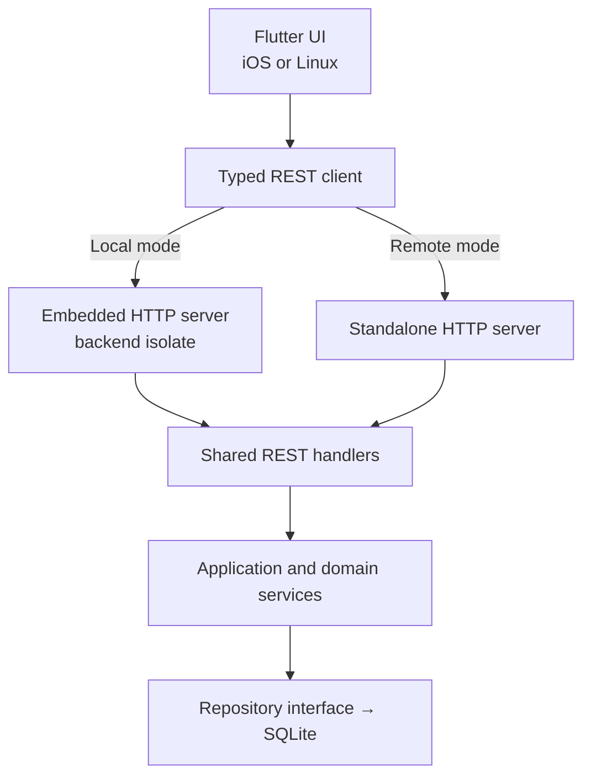
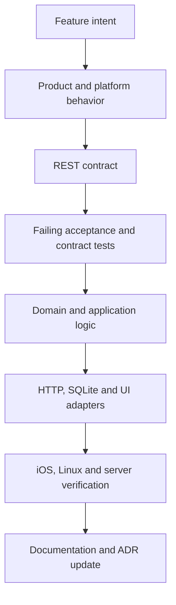

# todo
## Direct Answer

The revised project should use a **REST boundary for every application operation**, whether the backend is local or remote:

* Local mode: Flutter UI → loopback HTTP → embedded backend isolate → local SQLite.
* Remote mode: Flutter UI → HTTPS → standalone backend → remote SQLite.
* The same API routes, application services, validation, and repository interfaces are used in both modes.
* There is no synchronization subsystem before v1.0.
* Switching backends switches the source of truth; it does not merge or copy local and remote data.
* Performance benchmarking and optimization are deferred until after v1.0 produces real usage data.

One terminology correction: REST is not the platform-specific design. REST is the **platform-independent boundary**. The platform-specific work concerns iOS lifecycle/navigation and Linux Wayland/keyboard behavior.

---

## Revised Runtime Architecture



### Local mode

The Flutter process starts a dedicated Dart backend isolate:

1. Load backend configuration.
2. Spawn the backend isolate.
3. Open and migrate the local SQLite database.
4. Bind an HTTP server to `127.0.0.1` using port `0`.
5. The operating system assigns an unused port.
6. Generate a random per-launch authentication token.
7. Return the port and token to the UI isolate.
8. Wait for `/api/v1/health` to report ready.
9. Construct the REST client.
10. Render the application.

Dart supports explicitly binding an HTTP server to the loopback interface, thereby accepting only local-host connections. [Dart `HttpServer`](https://api.dart.dev/dart-io/HttpServer-class.html)

The embedded server should use a Dart **isolate**, not a manually managed thread. It owns:

* HTTP listener.
* REST routing.
* SQLite connection.
* Application services.
* Database migrations.

The UI isolate never opens SQLite directly.

### iOS lifecycle limitation

The embedded server is not an iOS daemon. It exists only inside the application process. When iOS suspends the application, the embedded backend may also stop executing until the app resumes.

That is acceptable because the UI is suspended at the same time. Therefore:

* Every write must commit before returning a successful HTTP response.
* The backend must not depend on receiving a shutdown event.
* App resume must verify backend health and restart it if necessary.
* No scheduled background backend work is included before v1.0.

Flutter explicitly warns that lifecycle notifications can be skipped and that applications should not assume every transition will be delivered. [Flutter application lifecycle](https://api.flutter.dev/flutter/dart-ui/AppLifecycleState.html)

### Local loopback security

Even though the server binds to loopback, use:

```http
Authorization: Local <random-256-bit-session-token>
```

Also:

* Use an ephemeral port.
* Do not persist the local session token.
* Reject requests without the correct token.
* Disable diagnostic routes in release builds.
* Do not bind the embedded server to `0.0.0.0`.

### Remote mode

Remote mode skips the embedded backend and configures the same REST client with:

```text
Backend mode: remote
Base URL:     https://todo.example.net
Vault ID:     personal
Credential:   stored securely by the platform
```

Credentials should be stored in:

* iOS: Keychain.
* Linux: Secret Service when available; otherwise a `0600` configuration file.

Remote mode is online-only through v1.0. If the server is unreachable, the UI displays an explicit offline error. It must not silently fall back to the local database.

---

## Backend Mode Semantics

| Property                    | Local mode                   | Remote mode             |
| --------------------------- | ---------------------------- | ----------------------- |
| HTTP destination            | `127.0.0.1:<ephemeral>`      | Configured HTTPS URL    |
| Server lifetime             | Flutter application lifetime | Independent process     |
| Database                    | Application-local SQLite     | Server vault SQLite     |
| Authentication              | Random launch token          | Persistent bearer token |
| Offline operation           | Yes                          | No                      |
| Data transfer between modes | No                           | No                      |
| API contract                | Same v1 contract             | Same v1 contract        |

Changing modes changes the active dataset. Import, export, migration, and synchronization between datasets are separate future capabilities.

---

## API to Implement

Use `api/openapi.yaml` as the normative contract.

All vault data routes use:

```text
/api/v1/vaults/{vault_id}/...
```

The embedded backend uses a fixed internal vault such as `default`.

### System API

| Method | Route                  | Purpose                                            |
| ------ | ---------------------- | -------------------------------------------------- |
| `GET`  | `/api/v1/health`       | Process readiness                                  |
| `GET`  | `/api/v1/capabilities` | API version, schema version and supported features |
| `GET`  | `/api/v1/vaults`       | List accessible vaults; primarily remote mode      |

### Task API

| Method   | Route                                        | Purpose                                     |
| -------- | -------------------------------------------- | ------------------------------------------- |
| `GET`    | `/vaults/{id}/tasks`                         | Query tasks                                 |
| `POST`   | `/vaults/{id}/tasks`                         | Create task                                 |
| `GET`    | `/vaults/{id}/tasks/{task_id}`               | Read one task                               |
| `PATCH`  | `/vaults/{id}/tasks/{task_id}`               | Edit title, notes, status or classification |
| `DELETE` | `/vaults/{id}/tasks/{task_id}`               | Soft-delete task                            |
| `POST`   | `/vaults/{id}/tasks/{task_id}/restore`       | Restore recently deleted task               |
| `PUT`    | `/vaults/{id}/tasks/{task_id}/tags/{tag_id}` | Assign tag                                  |
| `DELETE` | `/vaults/{id}/tasks/{task_id}/tags/{tag_id}` | Remove tag                                  |

Task query parameters:

```text
status=open|completed|all
quadrant=1|2|3|4
tag_id=<uuid>
sort=matrix_modified_asc
```

The defined sort is:

```sql
ORDER BY
    is_urgent DESC,
    is_important DESC,
    updated_at ASC,
    id ASC
```

### Quadrant read model

| Method | Route                                | Purpose                                             |
| ------ | ------------------------------------ | --------------------------------------------------- |
| `GET`  | `/vaults/{id}/quadrants?status=open` | Return all four grouped task collections and counts |

Quadrant remains derived:

```text
Q1 = urgent && important
Q2 = !urgent && important
Q3 = urgent && !important
Q4 = !urgent && !important
```

### Tag API

| Method   | Route                              | Purpose                            |
| -------- | ---------------------------------- | ---------------------------------- |
| `GET`    | `/vaults/{id}/tags`                | Tags with completed/total progress |
| `POST`   | `/vaults/{id}/tags`                | Create tag                         |
| `GET`    | `/vaults/{id}/tags/{tag_id}`       | Read tag                           |
| `PATCH`  | `/vaults/{id}/tags/{tag_id}`       | Rename or recolor tag              |
| `DELETE` | `/vaults/{id}/tags/{tag_id}`       | Soft-delete tag                    |
| `GET`    | `/vaults/{id}/tags/{tag_id}/tasks` | Sorted, filtered task list         |

### Concurrency

Every mutable resource should have a numeric `version` and HTTP `ETag`.

Update requests use:

```http
If-Match: "7"
```

If the resource has changed, return:

```http
412 Precondition Failed
Content-Type: application/problem+json
```

Use the standardized Problem Details format rather than inventing a separate error envelope. [RFC 9457](https://www.rfc-editor.org/rfc/rfc9457.html)

---

## Implementation Packages

```text
quadrant-todo/
├── AGENTS.md
├── pubspec.yaml
├── api/
│   ├── openapi.yaml
│   ├── examples/
│   └── problem-types/
│
├── apps/
│   └── quadrant_todo/
│       ├── lib/
│       │   ├── bootstrap/
│       │   │   ├── local_bootstrap.dart
│       │   │   └── remote_bootstrap.dart
│       │   ├── presentation/
│       │   └── platform/
│       ├── ios/
│       ├── linux/
│       ├── test/
│       └── integration_test/
│
├── packages/
│   ├── quadrant_domain/
│   │   ├── entities/
│   │   ├── rules/
│   │   └── value_objects/
│   ├── quadrant_application/
│   │   ├── commands/
│   │   ├── queries/
│   │   └── services/
│   ├── quadrant_store/
│   │   ├── database/
│   │   ├── migrations/
│   │   └── repositories/
│   ├── quadrant_api_server/
│   │   ├── handlers/
│   │   ├── middleware/
│   │   ├── dto/
│   │   └── routing/
│   ├── quadrant_api_client/
│   │   ├── client/
│   │   ├── dto/
│   │   └── errors/
│   └── quadrant_backend_host/
│       ├── embedded_backend.dart
│       ├── remote_profile.dart
│       └── backend_lifecycle.dart
│
├── server/
│   ├── bin/quadrant_server.dart
│   ├── lib/
│   │   ├── daemon/
│   │   ├── vaults/
│   │   ├── auth/
│   │   └── configuration/
│   └── test/
│
├── devops/
│   ├── bootstrap/
│   ├── ci/
│   ├── docs/
│   ├── ios/
│   ├── linux/
│   ├── server/
│   │   └── systemd/
│   ├── release/
│   └── agents/
│
├── docs/
│   ├── pyproject.toml
│   ├── Makefile
│   └── src/
│
└── .agents/
    └── skills/
```

### Dependency restrictions

```text
presentation → api_client
bootstrap → api_client + backend_host
api_server → application
application → domain + repository interfaces
store → repository interfaces
server → api_server + store
```

Prohibited dependencies:

* Presentation importing Drift.
* Presentation importing SQLite models.
* REST handlers containing quadrant rules.
* Local backend having routes absent from remote backend.
* Platform code bypassing the REST client.

---

## Revised Sphinx Structure

There is no `synchronization/`, `development/`, `operations/`, or `performance/` section.

```text
docs/src/
├── index.rst
│
├── intro/
│   ├── index.rst
│   ├── project-overview.rst
│   ├── goals-and-non-goals.rst
│   ├── terminology.rst
│   └── roadmap.rst
│
├── product/
│   ├── index.rst
│   ├── task-behavior.rst
│   ├── quadrant-behavior.rst
│   ├── tag-behavior.rst
│   ├── sorting-filtering.rst
│   └── backend-modes.rst
│
├── architecture/
│   ├── index.rst
│   ├── system-context.rst
│   ├── runtime-modes.rst
│   ├── rest-boundary.rst
│   ├── conceptual-layers.rst
│   ├── domain-model.rst
│   ├── command-query-flow.rst
│   ├── persistence-concept.rst
│   ├── backend-lifecycle.rst
│   ├── error-model.rst
│   └── security-boundaries.rst
│
├── api/
│   ├── index.rst
│   ├── conventions.rst
│   ├── system-api.rst
│   ├── task-api.rst
│   ├── quadrant-api.rst
│   ├── tag-api.rst
│   ├── concurrency.rst
│   ├── errors.rst
│   └── compatibility.rst
│
├── platforms/
│   ├── index.rst
│   ├── shared-ui.rst
│   ├── ios/
│   │   ├── index.rst
│   │   ├── navigation.rst
│   │   ├── local-backend-lifecycle.rst
│   │   ├── storage-security.rst
│   │   └── engineering-decisions.rst
│   ├── linux/
│   │   ├── index.rst
│   │   ├── sway-wayland.rst
│   │   ├── keyboard-navigation.rst
│   │   ├── local-backend-lifecycle.rst
│   │   └── engineering-decisions.rst
│   └── server/
│       ├── index.rst
│       ├── foreground-mode.rst
│       ├── daemon-mode.rst
│       ├── vault-files.rst
│       └── engineering-decisions.rst
│
├── implementation/
│   ├── index.rst
│   ├── package-map.rst
│   ├── application-bootstrap.rst
│   ├── embedded-http-server.rst
│   ├── rest-client.rst
│   ├── task-vertical-slice.rst
│   ├── tag-vertical-slice.rst
│   ├── sqlite-schema.rst
│   ├── migrations.rst
│   ├── error-handling.rst
│   └── backend-selection.rst
│
├── testing/
│   ├── index.rst
│   ├── behavior-specifications.rst
│   ├── domain-tests.rst
│   ├── api-contract-tests.rst
│   ├── backend-conformance.rst
│   ├── database-tests.rst
│   ├── shared-ui-tests.rst
│   ├── ios-tests.rst
│   ├── linux-tests.rst
│   ├── server-tests.rst
│   └── acceptance-tests.rst
│
├── devops/
│   ├── index.rst
│   ├── environment-bootstrap.rst
│   ├── dependency-management.rst
│   ├── generated-code.rst
│   ├── quality-gates.rst
│   ├── test-commands.rst
│   ├── documentation-build.rst
│   ├── ios-build-signing.rst
│   ├── linux-build-packaging.rst
│   ├── server-service.rst
│   ├── database-backup.rst
│   └── release-process.rst
│
├── agents/
│   ├── index.rst
│   ├── agent-working-model.rst
│   ├── rules-generation.rst
│   ├── skills-generation.rst
│   ├── feature-workflow.rst
│   └── evidence-and-review.rst
│
├── decisions/
│   ├── index.rst
│   ├── adr-0001-flutter.rst
│   ├── adr-0002-rest-everywhere.rst
│   ├── adr-0003-embedded-backend-isolate.rst
│   ├── adr-0004-sqlite-vaults.rst
│   └── adr-0005-no-sync-before-v1.rst
│
└── reference/
    ├── index.rst
    ├── command-reference.rst
    ├── configuration-reference.rst
    ├── keyboard-reference.rst
    ├── database-reference.rst
    └── http-status-reference.rst
```

The `architecture/` section explains concepts and boundaries. The `implementation/` section explains where those concepts become code. The `platforms/` section records platform-specific design decisions.

---

## Keeping Documentation Current

Documentation is part of each feature, not a later cleanup stage.

Every feature change must update, where applicable:

1. Product behavior.
2. Architecture or ADR.
3. OpenAPI contract.
4. Platform behavior.
5. Tests.
6. Implementation documentation.
7. Release notes.

Automated documentation checks:

```bash
sphinx-build -W --keep-going -b html docs/src docs/build/html
sphinx-build -W --keep-going -b linkcheck docs/src docs/build/linkcheck
```

Additional rules:

* Use `literalinclude` for code that must exactly match the repository.
* Do not manually duplicate the OpenAPI schema in multiple pages.
* Generate API summaries from `api/openapi.yaml`.
* Build documentation with warnings treated as errors.
* Use Sphinx `versionadded`, `versionchanged`, and `deprecated` directives.
* Reject committed generated files that differ from regeneration.
* Require an ADR for changes crossing two or more architectural boundaries.

Sphinx provides `toctree`, `literalinclude`, and version-change directives for these purposes. [Sphinx reStructuredText directives](https://www.sphinx-doc.org/en/master/usage/restructuredtext/directives.html)

---

## Specification-First Engineering Cycle



### Required cycle for every feature

1. Define observable product behavior.
2. Define iOS and Linux interaction behavior.
3. Define or update the REST contract.
4. Write backend conformance tests.
5. Write domain tests.
6. Write platform acceptance tests where practical.
7. Implement the domain/application behavior.
8. Implement REST handlers and persistence.
9. Implement iOS and Linux presentation.
10. Run the same API test suite against embedded and standalone servers.
11. Update Sphinx documentation.
12. Record an ADR if an architectural decision changed.

### Example: toggle task completion

Before implementation, define:

| Layer       | Required behavior                                  |
| ----------- | -------------------------------------------------- |
| Product     | Open becomes completed; completed becomes open     |
| Domain      | Set or clear `completed_at`; increment version     |
| REST        | `PATCH /tasks/{id}` with new status and `If-Match` |
| iOS         | Tap completion control                             |
| Linux       | `Enter` on focused task                            |
| Persistence | Commit before returning `200`                      |
| Conflict    | Stale version returns `412`                        |
| Tests       | Same result against local and standalone backends  |

Only then implement the code.

---

## Testing Architecture

The most important test artifact is a reusable backend conformance suite:

```text
BackendContractSuite
├── EmbeddedBackendHarness
└── StandaloneBackendHarness
```

Every REST behavior must pass against both harnesses.

### Testing order

| Level                  | Defines                                 |
| ---------------------- | --------------------------------------- |
| Product specification  | What the user observes                  |
| Platform specification | How iOS and Linux expose that behavior  |
| API contract           | How UI requests the behavior            |
| Domain test            | Business state transition               |
| Repository test        | Persistent result                       |
| Handler test           | HTTP semantics                          |
| Backend conformance    | Local and remote behavioral equivalence |
| Platform integration   | Actual interaction and lifecycle        |
| Acceptance test        | Complete feature outcome                |

Testing should emphasize correctness, lifecycle, compatibility, and accessibility. Formal performance targets and benchmark infrastructure are excluded until after v1.0.

---

## Agent Rules and Skills

Use `AGENTS.md` for concise, durable repository rules. Use repository skills for repeatable multi-step workflows. Official Codex guidance places repository-specific skills under `.agents/skills` and recommends keeping `AGENTS.md` small and focused. [Codex customization guidance](https://developers.openai.com/codex/concepts/customization)

### Rules hierarchy

```text
AGENTS.md
apps/quadrant_todo/AGENTS.md
packages/quadrant_api_server/AGENTS.md
server/AGENTS.md
docs/AGENTS.md
```

Root rules should include:

```text
- The UI communicates with backends only through the REST client.
- Local and standalone backends must pass the same conformance suite.
- Update OpenAPI before implementing an API-breaking change.
- Define platform behavior and tests before implementation.
- Do not place business rules in widgets or REST handlers.
- Do not edit generated files directly.
- Every feature change must update applicable Sphinx pages.
- Do not introduce synchronization before v1.0.
- Do not add performance optimization without measured evidence.
```

Nested rules contain only subtree-specific requirements.

### Initial repository skills

```text
.agents/skills/
├── implement-vertical-slice/
├── update-rest-contract/
├── add-database-migration/
├── verify-backend-conformance/
└── prepare-release/
```

Each skill contains:

```text
skill-name/
├── SKILL.md
├── scripts/       # only when deterministic automation is useful
├── references/    # detailed schemas or checklists
└── assets/        # templates used in generated output
```

Skill generation procedure:

1. Define example requests that should trigger the skill.
2. Identify repeated steps.
3. Move permanent rules to `AGENTS.md`.
4. Keep only the reusable procedure in `SKILL.md`.
5. Put large schemas and examples in `references/`.
6. Add scripts only for deterministic repeated actions.
7. Validate metadata and naming.
8. Run the skill on a representative feature.
9. Check the resulting code, tests and documentation.
10. Revise the skill when the same review problem recurs.

Skills should use lowercase hyphenated names and concise trigger descriptions. They should not duplicate the complete architecture documentation.

---

## Plan Through v1.0

| Version | Implementation scope                                                    | Required documentation and tests                                |
| ------- | ----------------------------------------------------------------------- | --------------------------------------------------------------- |
| v0.1    | Repository, Sphinx, OpenAPI skeleton, health API, embedded server spike | Architecture foundations, REST ADR, health contract tests       |
| v0.2    | Task and tag domain, SQLite, CRUD REST API                              | Domain model, task/tag API, repository and migration tests      |
| v0.3    | Linux local alpha                                                       | Sway design, keyboard behavior, Linux acceptance tests          |
| v0.4    | iOS local alpha                                                         | iOS navigation/lifecycle, physical-device tests                 |
| v0.5    | Local feature-complete beta                                             | Quadrants, progress, filtering, sorting, deletion/restore       |
| v0.6    | Standalone server                                                       | Foreground/daemon modes, vault management, server tests         |
| v0.7    | Remote backend mode                                                     | Backend selector, authentication, HTTPS/error behavior          |
| v0.8    | Compatibility hardening                                                 | ETag concurrency, API compatibility, migration/backup recovery  |
| v0.9    | Release candidate                                                       | Packaging, signing, complete docs, real personal-use validation |
| v1.0    | Stable release                                                          | Frozen v1 API, release checklist, documented upgrade policy     |

### v0.1 — Architectural walking skeleton

Implement:

* Dart workspace.
* Flutter iOS/Linux application shell.
* Sphinx structure.
* `api/openapi.yaml`.
* Shared `/health` handler.
* Embedded backend isolate.
* Loopback port discovery.
* Local session token.
* Typed REST health client.
* Standalone server using the same handler.
* First backend conformance test.

Exit condition: the same health test passes against embedded and standalone backends.

### v0.2 — Domain and persistence

Implement:

* Task and tag entities.
* Quadrant derivation.
* Application commands and queries.
* SQLite schema and migrations.
* CRUD endpoints.
* Problem Details responses.
* Version/ETag behavior.
* Tag progress query.
* Required sorting.

Exit condition: all behavior works through HTTP; no UI directly accesses storage.

### v0.3 — Linux local alpha

Implement:

* Three tabs.
* Quadrant layout.
* Tag progress view.
* Tag task view.
* `Alt+1/2/3`.
* `h/j/k/l`.
* `Enter` completion toggle.
* Text-focus shortcut suppression.
* Sway/Wayland lifecycle tests.

### v0.4 — iOS local alpha

Implement:

* Bottom tab navigation.
* iPhone-sized quadrant presentation.
* Tag navigation.
* Task editor.
* Embedded backend startup/resume recovery.
* Keychain-ready credential abstraction.
* Physical iPhone 13 Pro verification.

### v0.5 — Local product beta

Complete:

* All CRUD behavior.
* Soft deletion and undo.
* Filtering.
* Deterministic sorting.
* Empty/error/loading states.
* Database export and restoration.
* Local backup documentation.
* Accessibility checks.

This is the first version suitable for sustained personal use.

### v0.6 — Standalone server

Implement:

* Foreground operation by default.
* `--daemon`.
* PID and log files.
* Graceful `SIGINT`/`SIGTERM`.
* Multiple vault SQLite files.
* Vault-name/path validation.
* Bearer authentication.
* systemd user service.
* Backup command.

### v0.7 — Remote mode

Implement:

* Backend settings sheet.
* Remote URL and vault configuration.
* Secure credential storage.
* Capability/version negotiation.
* Remote connectivity diagnostics.
* Explicit offline state.
* Protection against accidental backend switching.

No synchronization or automatic copying is introduced.

### v0.8 — Hardening

Implement:

* Concurrency conflicts.
* Corrupt configuration recovery.
* Database migration recovery.
* Backup/restore verification.
* Local backend restart after lifecycle interruption.
* API compatibility tests.
* Authentication failure handling.
* Accessibility corrections.

### v0.9 — Release candidate

Perform sustained real use on:

* iPhone 13 Pro.
* Arch Linux with Sway.
* Local mode.
* Remote mode.
* Foreground server.
* systemd-managed server.

Fix observed correctness and usability problems. Do not optimize based solely on synthetic benchmarks.

### v1.0 — Stable product

v1.0 requires:

* Stable v1 REST contract.
* Complete local and remote backend conformance.
* Tested migrations from every released schema.
* Recoverable backups.
* Working iOS and Linux installation instructions.
* Complete keyboard and touch workflows.
* Sphinx build without warnings.
* Documented release and rollback procedure.
* No unresolved data-loss or lifecycle defect.

After v1.0, measure actual startup time, request latency, database size, memory use and large-list behavior. Those measurements should determine the first performance milestone.
